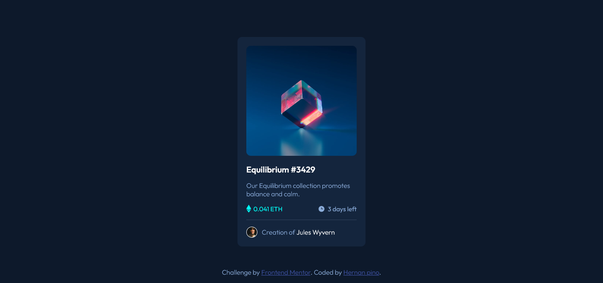

# Frontend Mentor - NFT preview card component solution

This is a solution to the [NFT preview card component challenge on Frontend Mentor](https://www.frontendmentor.io/challenges/nft-preview-card-component-SbdUL_w0U). Frontend Mentor challenges help you improve your coding skills by building realistic projects. 

### Links

- Solution URL: [https://github.com/hernan-pino/nftCard-frontMentor](https://your-solution-url.com)
- Live Site URL: [https://hernan-pino.github.io/nftCard-frontMentor/](https://your-live-site-url.com)

## My process

### Built with

- Semantic HTML5 markup
- CSS custom properties
- Flexbox

## Author

- Website - [https://hernanpinovalencia.com/](https://www.your-site.com)
- Frontend Mentor - [@hernan-pino](https://www.frontendmentor.io/profile/yourusername)

